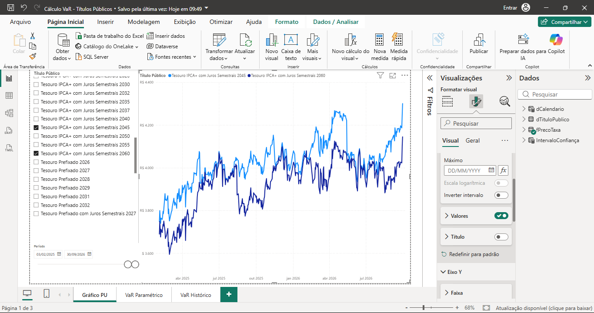
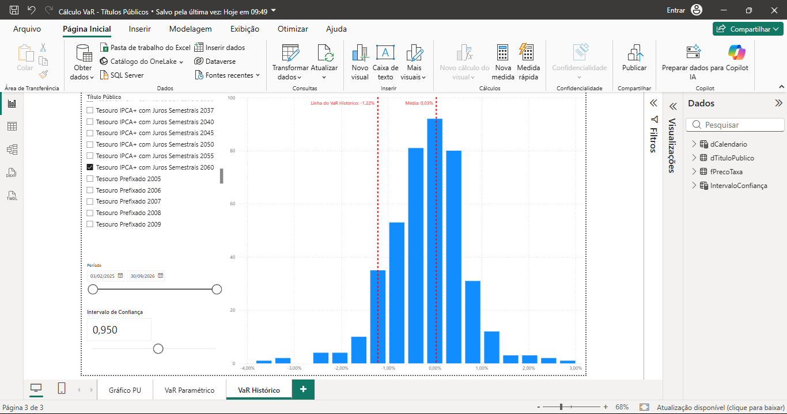

📊 Cálculo de Value at Risk (V@R) de Títulos Públicos | Power BI

Este projeto consiste em 3 painéis no Power BI focados na análise de risco de mercado (V@R) para Títulos Públicos, aplicando 2 abordagens distintas para mensuração de risco: VaR Paramétrico e VaR Histórico, com parametrização dinâmica do Intervalo de Confiança e do Período de Análise.

🖼 Visão Geral e Telas

O relatório foi estruturado em 3 painéis:

Evolução do Preço Unitário (PU): Acompanhamento temporal da curva de preços de um título público.

VaR Paramétrico: Cálculo da perda máxima esperada considerando a volatilidade da série e o intervalo de confiança num determinado período.

VaR Histórico: Análise não paramétrica baseada no percentil real da distribuição dos retornos observados num determinado período.

